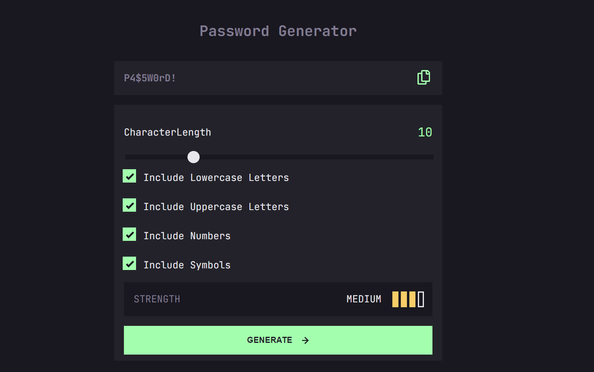

# Password Generator Application 

## Table of Contents

- [Overview](#overview)
- [Features](#features)
- [Getting Started](#getting-started)
  - [Installation](#installation)
  - [Running the App](#running-the-app)
- [Components](#components)
  - [CharacterLengthContainer](#characterlengthcontainer)
  - [Checkbox](#checkbox)
  - [GeneratePasswordButton](#generatepasswordbutton)
  - [PasswordContainer](#passwordcontainer)
  - [PasswordWithEffect](#passwordwitheffect)
  - [StrengthIndicator](#strengthindicator)
- [Styling](#styling)
- [Contributing](#contributing)

## Overview

This project is a Password Generator application built with React TypeScript. It allows users to generate secure passwords based on selected criteria such as length, and inclusion of uppercase letters, lowercase letters, numbers, and symbols.

[](https://randompasswrd.netlify.app/)

## Features

- Adjustable password length
- Options to include uppercase letters, lowercase letters, numbers, and symbols
- Visual strength indicator for generated passwords
- Copy to clipboard functionality
- Responsive and styled using styled-components

## Getting Started

### Installation

To get a local copy up and running, follow these steps:

1. Clone the repository:

   ```sh
   git clone https://github.com/nyarko-i/PasswordGeneratorApp.git
   ```

2. Navigate to the project directory:

   ```sh
   cd password-generator
   ```

3. Install dependencies:
   ```sh
   npm install
   ```

### Running the App

To start the application, run:

```sh
npm run dev
```

Open [http://localhost:5173](http://localhost:5173) to view it in the browser.

## Components

### CharacterLengthContainer

This component allows users to set the desired length for the password using a slider. It displays the current length and updates the visual representation based on user input.

### Checkbox

The Checkbox component provides options for users to include lowercase letters, uppercase letters, numbers, and symbols in the generated password.

### GeneratePasswordButton

This button triggers the password generation process. It checks the selected options and generates a password accordingly, handling error states if no options are selected.

### PasswordContainer

Displays the generated password or an error message if no options are selected. It includes functionality to copy the password to the clipboard and shows a 'COPIED' message when the password is copied.

### PasswordWithEffect

Renders the password with an animated effect, gradually revealing the actual password characters.

### StrengthIndicator

Calculates and displays the strength of the generated password based on selected options and password length. Strength levels include "TOO WEAK!", "WEAK", "MEDIUM", and "STRONG".

## Styling

The project uses styled-components for styling. Styles for each component are defined in the `styles` directory.

## Contributing

Contributions are welcome! Please open an issue or submit a pull request for any improvements or bug fixes.
